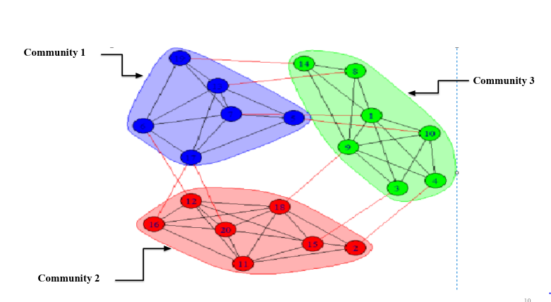

# Friend-suggestion-system-using-community-detection
#### A simple way of exploiting social network structure of users to suggest friends.
It is a human tendency of peoples to get asscoiated with other peoples based on similar interests, taste, or preferences. The detection of such associations on social media sites can be helpful in marketing industry.

The working flow of the model is:-
1. Represent friendship relation of users using graph. Find communities in the graph using Louvain algorithm. 
2. Suggest users to other users who are not friends from the community to which both belongs

Download he data of fb users from [here](http://konect.uni-koblenz.de/networks/ego-facebook)
Read more about community detection and louvain algorithm from [here](https://arxiv.org/pdf/0803.0476.pdf)
